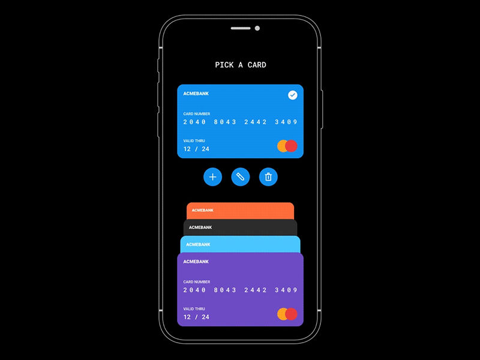

<h1 align="center">PICK A CARD</h1>

> Pick a card in Flutter, inspired by [Dribbble design](https://cdn.dribbble.com/users/649939/screenshots/5960307/cards.gif?fbclid=IwAR3BdTXouq2_1h-MnQ-MMRkkiSue9tD3EgpfutNypxjiF_zqIX3GBaOpKxY).

See [demo](https://ducthu-dev.github.io/Pick-a-card/).

